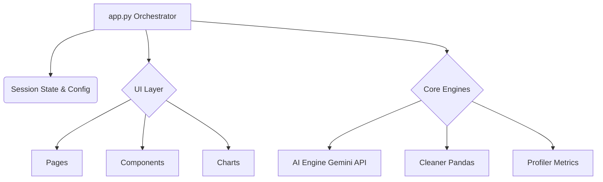

# CleanFlow AI (AI Data Cleaner Pro) — Design Document

## 1. System Architecture Overview

CleanFlow AI is designed as a **monolithic but highly modular** Streamlit application. The primary design goal is to separate the presentation layer (UI) from the business logic (Data Cleaning & AI) to ensure scalability, ease of maintenance, and the potential for future migration to a decoupled API-Frontend architecture (e.g., FastAPI + React).

---

## 2. Directory & Module Breakdown

The project follows a strict domain-driven structure:

### 📁 `config/` (Settings & Themes)
- **`settings.py`**: Centralized configuration constants, environment variable loading, and static definitions (e.g., sample datasets, max file sizes).
- **`themes.py`**: Manages the custom Glassmorphism CSS system. It dynamically injects styles based on the user's selected mode (Dark/Light).

### 📁 `core/` (Business Logic)
- **`ai_engine.py`**: A Singleton wrapper around the Google GenAI SDK. It handles prompt formatting, API communication, and fallback mechanisms for context-aware data analysis.
- **`cleaner.py`**: The data transformation engine. It wraps Pandas operations (e.g., imputation, deduplication, IQR capping) into safe, auditable functions.
- **`profiler.py`**: The analytical brain. It calculates a 0-100 Composite Health Score across 5 dimensions (Completeness, Consistency, Uniqueness, Validity, Shape) and performs semantic type inference.

### 📁 `ui/` (Presentation)
- **`pages.py`**: Contains the render logic for the main tabs (Overview, Profiling, Issues, AI Assistant, Cleaning Studio, Results).
- **`charts.py`**: A library of reusable Plotly functions to generate Radar Maps, Heatmaps, and Distribution Plots.
- **`components.py`**: Modular UI fragments like metrics cards, badges, and stylings.

###  `app.py` (Orchestrator)
The thin entry point. It handles file parsing, initializes the `st.session_state` dictionary for state persistence (undo stacks, logs, themes), caches the `AIEngine`, and routes rendering to `ui/pages.py`.

---

## 3. Key Design Patterns

### 3.1 State Management (Undo/Redo)
CleanFlow AI treats the dataset as an immutable object whenever an operation occurs. 
- Transformations executed via `cleaner.py` push the old DataFrame state to an `undo_stack` in `st.session_state`.
- An `audit_log` records semantic descriptions of transformations (e.g., "Dropped 14 duplicate rows") for reproducibility.

### 3.2 Singleton AI Instantiation
The `AIEngine` is initialized using Streamlit's `@st.cache_resource`. This ensures only one API client is created globally, preventing memory leaks and redundant authentication calls during re-renders.

### 3.3 Semantic Type Inference
Instead of relying solely on Pandas' `dtype`, the `profiler.py` analyzes data distributions to determine *Semantic Types*. For example, a numeric column with only `1` and `0` is inferred as a `Boolean/Category` rather than a standard float, driving better cleaning heuristics and AI prompts.

---

## 4. UI/UX Design System (Glassmorphism)

The visual design departs from standard Streamlit UI by injecting a heavy layer of custom Vanilla CSS.

- **Aesthetic:** "Glassmorphism" — characterized by semi-transparent backgrounds, subtle borders, and background blur, giving elements a frosted-glass look floating over a vibrant gradient.
- **Themes:** Fully supports Dark Mode (default) and Light Mode via CSS variables (`--bg-color`, `--card-bg`, `--text-main`).
- **Responsive:** Layouts utilize Streamlit's column system, wrapped in custom CSS classes to ensure charts and cards stack elegantly on smaller screens.

---

## 5. Scalability & Future Architecture

While currently a Streamlit application, the strict boundary between `/core` and `/ui` prepares the system for:
1. **API Decoupling:** The `/core` modules can easily be wrapped in FastAPI endpoints.
2. **Batch Processing:** `cleaner.py` can be integrated into Airflow or Prefect dags for automated pipeline execution.
3. **Database Integration:** The audit log and conversational history can be persisted to a PostgreSQL database rather than relying on ephemeral session state.
